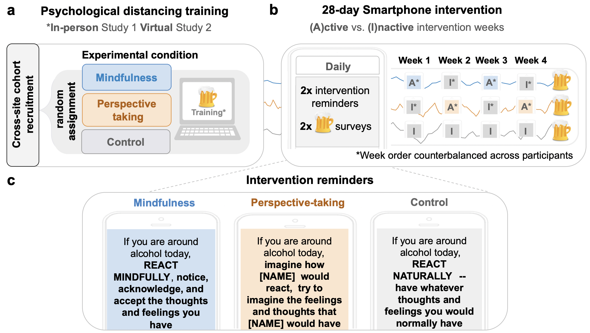

<br>

```{r setup, include=F, warning=F}
rm(list=ls()) 

#Load packages
if(!require('pacman')) {install.packages('pacman')}
pacman::p_load(dplyr, rstatix, ggpubr, kableExtra, DataCombine, sjmisc, sjPlot, janitor, reshape,
               emmeans, ggplot2, glmmTMB, coefplot2, psych, sjPlot, MASS, gtsummary, coefplot2, coin)

#Define aesthetics
palette = c("darkgray","#0C7BDC","#D55E00")
```

```{r, include=T, warning=F}
#EMA1 = Load Study 1 ecological momentary assessment clean dataframe
EMA1 = read.csv("data/osf_study1.csv", stringsAsFactors = FALSE)

#EMA2 = Load Study 2 ecological momentary assessment clean dataframe
EMA2 = read.csv("data/osf_study2.csv", stringsAsFactors = FALSE)

interventions_s1 = EMA1  %>% 
  filter(condition != 'control') %>% # filter individuals in control without a within-person manipulation 
  mutate(active_week =relevel(factor(active_week), ref = 'control')) #factor main predictor and set inactive weeks as reference. 

interventions_s2 = EMA2 %>% 
  filter(condition != 'control') %>% #filter individuals in control without a within-person manipulation 
  mutate(active_week =relevel(factor(active_week), ref = 'control')) #factor main predictor and set inactive weeks as reference. 
```

# Study overview

Using two randomized experiments, we examined whether theory-driven strategies to create psychological distance—mindfulness and perspective-taking—administered via smartphones, can reduce drinking in the daily lives of young adults over 28 days (Study1, N = `r length(unique(EMA1$id))`; Study 2, N = `r length(unique(EMA2$id))`).


**Method**

Fig 1. | Study procedure and intervention reminders.

a. College students, recruited across two different sites, completed online surveys and were randomly assigned to one of three experimental conditions. First, they completed a psychological training (in-person Study 1; or virtual Study 2) on how to respond to alcohol cues. 

b. Following the training, participants underwent a 28-day smartphone intervention in which they received two intervention reminder texts a day and two texts assessing their alcohol use. Participants in the mindfulness and perspective-taking conditions, received active intervention reminders on one week and control reminders the following week, with week order counterbalanced across participants.

c. Reminder text messages corresponding to condition assignment and week. 




**Hypotheses**:

We tested two competing hypotheses:

* Psychological distance-based trainings, such as mindfulness and perspective-taking, may help reduce drinking frequency and amount without the need for frequent reminders. If true, we expected the mindfulness and perspective-taking trainings to reduce drinking frequency and drinking amount irrespective of whether intervention reminders are present or absent. 

* Psychological distance-based trainings may not succeed in daily life without boosts from frequent distancing reminders. If true, we expected drinking frequency and amount to decrease on weeks when individuals received intervention reminders relative to weeks when they received control reminders.


**Citation**

Jovanova, M., Cosme, D., Doré, B., Kang, Y., Stanoi, O., Cooper, N., Helion, C., Lomax, S., McGowan, A., Boyd, Z., Basset, S, D., Mucha, J, P., Ochsner, N, K., Lydon-Staley, M, D., & Falk, E. (2022).<a href="https://psyarxiv.com/yw7s3/"> Psychological distance intervention reminders reduce alcohol consumption frequency in daily life.</a>

<br><br> 

# Main analyses


## Within-person analyses {.tabset}


To assess whether drinking levels varied on active weeks versus inactive weeks, we specified two separate multilevel hurdle models: one for Study 1 and another for Study 2, comprising individuals assigned to the mindfulness and perspective-taking conditions, who underwent both active and inactive intervention weeks. 

The main predictor of interest was active week (intervention reminders) versus inactive week (control reminders), collapsing across psychological distance strategies. 

The two main outcomes include frequency of drinking occasions and numbers of drinks per drinking occasion. Consistent with prior work, we modeled these two drinking outcomes separately.

* To further explore if the effectiveness of the reminders varied by specific psychological distancing strategy (mindfulness vs. perspective-taking), we also included an interaction term: condition type x active week (vs. inactive week). 


**Variables** :
 
* **active week** =  week type: intervention/active week vs. control/inactive week (ref.) 
* **condition** == psychological distancing strategy condition: perspective-taking vs. mindfulness (ref.)
* **signal count** == time in study: count of intervention prompts throughout study period [1-56]
* **alc reponses**  = response rate: count of participant responses to alcohol surveys [1-56]
* **social weekend** ==  weekend (Thursday-Sat) vs. week (ref. Sun-Wed)
* **activeXcondition(perspective)** == active intervention week (ref. inactive week) vs.perspective-taking condition (ref. mindfulness condition)

  
  
<br><br>

### Study 1 


**Drinking frequency:** Consistent with the second hypothesis, active compared to inactive weeks were associated with a higher probability  of not drinking: active week OR = 1.34,  95% CI [1.01 - 1.77], p = .041.

**Drinking amount:** In contrast to our hypotheses, we found no difference in the number of drinks consumed on alcohol use occasions following active intervention reminders, relative to following control reminders: (active week vs. inactive week; OR = 0.92,  95% CI [0.69 - 1.23], p = .575


Model note:

*  Hurdle models include a logistic regression to model the zeroes in the data as well as a count regression (in this case negative binomial) to model the counts. All the zeroes (not alcohol use occasions) were modeled with the logistic regression and nonzero-counts (alcohol use occasions) were modeled by a truncated negative binomial (i.e., truncated as it does not contain zero). 
  
* These models allowed us to independently model whether a person drinks or not (logistic regression) at a given occasion and number of drinks when an individual drinks (count regression).
 
   - The first 5 coefficients correspond to the conditional sub-model (count regression; drinks consumed per occasion)]
   
   - The last 5 coefficients correspond to the zero-inflated sub-model (probability of non-alcohol use; drinking occasion frequency). Positive odds ratio indicates **more occasions with no alcohol use.**

```{r, message=FALSE, warning=FALSE}
m_main_s1 <- glmmTMB(drinks_number ~ 1 +  active_week + condition 
                  + signal_count + alc_responses + social_weekend + active_week*condition + (1 | group/id),
                  zi = ~1 + active_week + condition 
                  + signal_count +  alc_responses + social_weekend + active_week*condition + (1 | group/id),
                  data = interventions_s1, 
                  family = truncated_nbinom2)

tbl_regression(m_main_s1,
               exponentiate = TRUE, conf.level = 0.95,
               pvalue_fun = ~style_pvalue(.x, digits = 3)) %>%
  modify_table_body(filter, !(variable == "active_week" & label == "control")) %>%
  bold_p() %>%
  remove_row_type(., variables = everything(),type = c("header"))
```


### Study 2

Study2 replicated Study1. 

**Drinking frequency:** Consistent with the second hypothesis, active compared to inactive weeks were associated with a higher probability  of not drinking: OR = 1.39,  95% CI [1.08 - 1.80],  p = .011. 

**Drinking amount:** We found no difference in the number of drinks consumed on alcohol use occasions following active intervention reminders, relative to following control reminders across both studies (Study 1 active week vs. inactive week: OR = 0.97,  95% CI [0.77 - 1.23], p = .816.) 


Model note:

*  Hurdle models include a logistic regression to model the zeroes in the data as well as a count regression (in this case negative binomial) to model the counts. All the zeroes (not alcohol use occasions) were modeled with the logistic regression and nonzero-counts (alcohol use occasions) were modeled by a truncated negative binomial (i.e., truncated as it does not contain zero). 
  
* These models allowed us to independently model whether a person drinks or not (logistic regression) at a given occasion and number of drinks when an individual drinks (count regression).
 
   - The first 5 coefficients correspond to the conditional sub-model (count regression; drinks consumed per occasion)]
   
   - The last 5 coefficients correspond to the zero-inflated sub-model (probability of non-alcohol use; drinking occasion frequency). Positive odds ratio indicates **more occasions with no alcohol use.**

```{r, message=FALSE, warning=FALSE}
m_main_s2 <- glmmTMB(drinks_number ~ 1 +  active_week + condition 
                  + signal_count +  alc_responses + social_weekend + active_week*condition + (1 | group/id),
                  zi = ~1 + active_week + condition 
                  + signal_count +  alc_responses + social_weekend + active_week*condition + (1 | group/id),
                  data = interventions_s2, 
                  family = truncated_nbinom2)

tbl_regression(m_main_s2,
               exponentiate = TRUE, conf.level = 0.95,
               pvalue_fun = ~style_pvalue(.x, digits = 3)) %>%
  modify_table_body(filter, !(variable == "active_week" & label == "control")) %>%
  bold_p() %>%
  remove_row_type(., variables = everything(),type = c("header")) 
```


### Plot

Fig 2.| Psychological distance reminders reduce drinking frequency but do not influence amount. 

```{r, fig.width = 7, fig.height = 8} 
plot1 = read.csv("data/EMA_plot1_osf.csv", stringsAsFactors = FALSE)
plot2 = read.csv("data/EMA_plot2_osf.csv", stringsAsFactors = FALSE)

par(mfrow = c(2,2))
layout.matrix <- matrix(c(0, 2, 1, 3), nrow = 2, ncol = 2)

names=c("control \n inactive weeks", "mindful \n active (left) \ninactive (right)", "perspective \n active (left) \ninactive (right)")

#plotting drinking frequency Study 1
m1=lm(prop_occasions_on ~ 0 + condition, data = plot1)
m2=lm(prop_occasions_off ~ 0 + condition, data = plot1)

m1coefs=c(NA,coeftab(m1)$Estimate)
m1ses=c(NA,coeftab(m1)$Std)

m2coefs=coeftab(m2)$Estimate
m2ses=coeftab(m2)$Std

coefplot2(m1coefs,m1ses,CI=.2, names, pch= 21,cex.pts= 2,vertical=F, 
          main = "Study 1",  var.las =1, ylim=c(.05,.25), cex.axis=3,
          ylab="proportion of drinking occasions", xlab="conditions", col.pts=palette)

coefplot2(m2coefs,m2ses,names, CI=.2, pch= 16,cex.pts= 2,vertical=F, offset = .15, ylim=c(.05,.25), main = "Study 1", 
                  var.las =1, cex.axis=3, ylab="proportion of drinking occasions", add=T, col.pts=palette)

#plotting drinking frequency Study 2
m1_s2=lm(prop_occasions_on ~ 0 + condition, plot2)
m2_s2=lm(prop_occasions_off ~ 0 + condition, plot2)

m1_s2coefs=c(NA,coeftab(m1_s2)$Estimate)
m1_s2ses=c(NA,coeftab(m1_s2)$Std)

m2_s2coefs=coeftab(m2_s2)$Estimate
m2_s2ses=coeftab(m2_s2)$Std

coefplot2(m1_s2coefs,m1_s2ses,names, CI=.95, pch= 21,cex.pts= 2,vertical=F, 
          main = "Study 2",  var.las =1, ylim=c(.05,.25), cex.axis=3,
          ylab="proportion of drinking occasions", xlab="conditions", col.pts=palette)

coefplot2(m2_s2coefs,m2_s2ses,names, CI=.95, pch= 16,cex.pts= 2,vertical=F, offset = .15, ylim=c(.05,.25), 
          main = "Study 2", 
                  var.las =1, cex.axis=3, ylab="proportion of drinking occasions", add=T, col.pts=palette)

##plotting drinking amount Study 1
m1on_1=lm(drinks_per_occ_on ~ 0 + condition, plot1)
m2off_1=lm(drinks_per_occ_off ~ 0 + condition, plot1)

m1d_oncoefs_1=c(NA,coeftab(m1on_1)$Estimate)
m1d_onses_1=c(NA,coeftab(m1on_1)$Std)

m1d_off_coefs_1=coeftab(m2off_1)$Estimate
m1d_offses_1=coeftab(m2off_1)$Std

coefplot2(m1d_oncoefs_1,m1d_onses_1,names,pch= 21, plot =TRUE, CI = .95, cex.pts= 2, vertical=F, ylim=c(0,5),
          xlab="conditions",main="Study 1", ylab="average drinks per occasion",var.las =1, col.pts=palette)
coefplot2(m1d_off_coefs_1,m1d_offses_1,names, pch= 16, plot = TRUE, CI =.95, cex.pts= 1.5,vertical=F, ylim=c(0,5),
          xlab="conditions",offset = .2,ylab="average drinks per occasion", var.las =1, add=T,col.pts=palette)

##plotting drinking amount Study 2
m1_on_d2=lm(drinks_per_occ_on ~ 0 + condition, plot2)
m2_off_d2=lm(drinks_per_occ_off ~ 0 + condition, plot2)

s2_m1dcoefs=c(NA,coeftab(m1_on_d2)$Estimate)
s2_m1dses=c(NA,coeftab(m1_on_d2)$Std)

m2dcoefs2=coeftab(m2_off_d2)$Estimate
m2dses2=coeftab(m2_off_d2)$Std

coefplot2(s2_m1dcoefs,s2_m1dses,names,pch= 21, plot =TRUE, CI = .95, cex.pts= 1.5, vertical=F, ylim=c(0,5),
          xlab="conditions", main = "Study 2", ylab="average drinks per occasion",var.las =1, col.pts=palette)

coefplot2(m2dcoefs2,m2dses2,names, pch= 16, plot = TRUE, CI =.95, cex.pts= 1.5,vertical=F, ylim=c(0,5),
          xlab= "conditions", offset = .2, main="Study 2", ylab="average drinks per occasion", add=T,var.las =1, col.pts=palette)
```

<br><br>

## Between-person analyses {.tabset}


We conducted follow-up analyses to explore whether the observed effects of psychological distance intervention reminders on drinking frequency differed from non-intervention related changes we might expect in the absence of intervention reminders. 

* To do this, we compared the average pseudo-inactive-to-active-week change scores in drinking frequency for the control group to inactive-to-active-week change scores for the intervention groups using an upaired two-samples wilcoxon test.


```{r}
#load change scores 
change_scores_1 = read.csv("data/prop_diff_plot1.csv", stringsAsFactors = FALSE) %>% 
  mutate(intervention = case_when(condition == 'mindful' | condition == 'perspective' ~ 'intervention',  TRUE ~ 'control'))

change_scores_2 = read.csv("data/prop_diff_plot2.csv", stringsAsFactors = FALSE) %>% 
  mutate(intervention = case_when(condition == 'mindful' | condition == 'perspective' ~ 'intervention',  TRUE ~ 'control'))
```

### Study 1


Individuals randomly assigned to the psychological distance interventions showed a greater decrease in drinking frequency from inactive weeks to active weeks relative to those in the control group in Study 1 (W  = 1002, Z = -2.013, p = .044, r = .194).  

```{r, message=FALSE, warning=FALSE}
#run wilcox test 
change_scores_1  %>% rstatix::wilcox_test(prop_diff ~ intervention) %>%
  data.frame() %>%
  mutate(W = statistic,
         Z = qnorm(p/2), # z-score 
         r = abs(Z/(sqrt(108)))) %>%  
  select(group1, group2, W, Z, p,r) %>%
  kable(format = "pandoc", digits=3)
```

### Study 2

Study2 replicated Study1. 

Individuals randomly assigned to the psychological distance interventions showed a greater decrease in drinking frequency from inactive weeks to active weeks relative to those in the control group in Study 2 (W = 3733, Z = -3.487, p = <.001, r = .236).

```{r}
change_scores_2  %>% rstatix::wilcox_test(prop_diff ~ intervention) %>%
  data.frame() %>%
  mutate(W= statistic, 
         Z = qnorm(p/2), # z-score 
         r = abs(Z/(sqrt(218)))) %>%
  select(group1, group2, W, Z, p, r) %>%
  kable(format = "pandoc", digits=3)
```


### Plot

Fig 3. | Reminders change drinking frequency among participants in the intervention conditions vs. control (Study 1 r =.194; Study 2 r = .236). 

```{r}
#graphing EMA FREQUENCY within-person 
change_scores_1$prop_diff_1 = change_scores_1$prop_diff*-1 #flipped change scores as negative for ease of interpretation: negative change scores indicate greater intervention-consistent reductions in drinking frequency from inactive to active weeks. 

change_scores_2$prop_diff_1 = change_scores_2$prop_diff*-1 #flipped change scores as negative for ease of interpretation 

m1=lm(prop_diff_1~  0 + condition, change_scores_1)
m2=lm(prop_diff_1~  0 + condition, change_scores_2)

names=c("control", "mindful", "perspective")

par(mfrow = c(2,2)) 

#Study 1 plot 
coefplot2(m1, intercept = TRUE, 
          pch= 18,cex.pts= 2,CI=.95,
          names, 
          lwd.1 = 0,
          main = "Study 1", ylab="% change scores in drinking frequency",
          ylim=c(-.08,.05), xlab="conditions",   var.las =1, 
          vertical=F, 
          col.pts=c("darkgray", "#0C7BDC","#D55E00"))

#Study 2 plot 
coefplot2(m2, intercept = TRUE, 
          pch= 18,cex.pts= 2,CI=.95,
          names, 
           main = "Study 2",
          ylim=c(-.08,.05), xlab="conditions",
          offset = .2, ylab="% change scores in drinking frequency", var.las =1, 
          lwd.1 = 0,
          vertical=F, 
          col.pts=c("darkgray", "#0C7BDC","#D55E00"))
```

<br><br>

# Supplementary analyses
## Within-person {.tabset}


We conducted two multilevel hurdle models, one for Study 1 and another for Study 2 to examine if the within-person effects of psychological distance reminders on drinking frequency, presented in the main manuscript, remain robust when controlling for demographic variables. 

We ran parallel multilevel models to those presented in the main manuscript including gender, age, and race as covariates. 

<br><br>

### Study 1

Main effects of intervention reminders on drinking frequency remained parallel when controlling for age, gender, and race in Study 1. 

**Drinking frequency:** Active compared to inactive weeks were associated with a higher probability of not drinking (active week: OR= 1.34,	95% CI[1.01, 1.77], p =	.042), Table S2. 

**Drinking amount:** We found no difference in the number of drinks consumed on alcohol use occasions following active intervention reminders, relative to following control reminders across both studies (Study 1 active week vs. inactive week: OR = 0.94,  95% CI [0.70 - 1.26], p = .669), Table S2.  


```{r, message=FALSE, warning=FALSE}
osf_study1_supp = read.csv("data/osf_study1_supp.csv", stringsAsFactors = FALSE) %>%
  filter(condition != 'control') %>% #remove participants not in intervention conditions 
  mutate(active_week =relevel(factor(active_week), ref = 'control')) # set control as reference group

osf_study2_supp  = read.csv("data/osf_study2_supp.csv", stringsAsFactors = FALSE) %>%
  filter(condition != 'control') %>% #remove participants not in intervention conditions 
  mutate(active_week =relevel(factor(active_week), ref = 'control')) # set control as reference group

m_supp_s1 <- glmmTMB(drinks_number ~ 1 +  active_week + condition 
                  + signal_count +  alc_responses + social_weekend + age + gender + race + active_week*condition + (1 | group/id),
                  zi = ~1 + active_week + condition + signal_count +  alc_responses + social_weekend +
                    age + gender + race + active_week*condition + (1 | group/id),
                  data = osf_study1_supp, 
                  family = truncated_nbinom2)

tbl_regression(m_supp_s1, 
               exponentiate =TRUE, conf.level = 0.95,
               pvalue_fun = ~style_pvalue(.x, digits = 3)) %>%
  modify_table_body(filter, !(variable == "active_week" & label == "control")) %>%
  bold_p() %>%
  remove_row_type(., variables = everything(),type = c("header"))
```

### Study 2

Similarly, main effects of intervention reminders on drinking frequency remained parallel when controlling for age, gender, and race in Study 2

**Drinking frequency:** Active compared to inactive weeks were associated with a higher probability of not drinking (active week: OR= 1.34,	95% CI[1.04, 1.74], p =	.025), Table S2.

**Drinking amount:** We found no difference in the number of drinks consumed on alcohol use occasions following active intervention reminders, relative to following control reminders across both studies (Study 1 active week vs. inactive week: OR = 0.95,  95% CI [0.75 - 1.22], p = .699, Table S2) 


```{r,warning=FALSE}
m_supp_s2 <- glmmTMB(drinks_number ~ 1 +  active_week + condition 
                  + signal_count +  alc_responses + social_weekend + age + gender + race + active_week*condition + (1 |  group/id),
                  zi = ~1 + active_week + condition + signal_count +  alc_responses + social_weekend +
                    age + gender + race + active_week*condition + (1 | group/id),
                  data = osf_study2_supp, 
                  family = truncated_nbinom2)

tbl_regression(m_supp_s2, 
               exponentiate =TRUE, conf.level = 0.95,
               pvalue_fun = ~style_pvalue(.x, digits = 3)) %>%
  modify_table_body(filter, !(variable == "active_week" & label == "control")) %>%
  bold_p() %>%
  remove_row_type(., variables = everything(),type = c("header"))
```

<br><br>

## Between-person {.tabset}


As a robustness check of potential influence of outliers on our results, we repeated the same between-person analyses from the main manuscript which compared changes in drinking frequency from inactive to active weeks between the intervention and control groups, winsorizing outliers +/- 2 standard deviations from the mean.


```{r}
change_scores_1 = read.csv("data/prop_diff_plot1.csv", stringsAsFactors = FALSE) %>% 
  mutate(intervention = case_when(condition == 'mindful' | condition == 'perspective' ~ 'intervention',  TRUE ~ 'control'), prop_diff_w =winsor(prop_diff, trim = 0.2, na.rm = TRUE)) #winsorize 2sd from mean

change_scores_2 = read.csv("data/prop_diff_plot2.csv", stringsAsFactors = FALSE) %>% 
  mutate(intervention = case_when(condition == 'mindful' | condition == 'perspective' ~ 'intervention',  TRUE ~ 'control'), prop_diff_w =winsor(prop_diff, trim = 0.2, na.rm = TRUE)) #winsorize 2sd from mean
```

### Study 1


Consistent with the finding reported in the main text, we found significant differences in behavior change between the intervention and control groups. 

Individuals in the intervention groups showed a greater decrease in drinking frequency from inactive weeks to active weeks relative to the control group in Study 1 (W = 948.5, Z = -2.146, p = .032, r = .206). 

```{r}
#run wilcox test 
change_scores_1  %>% rstatix::wilcox_test(prop_diff_w ~ intervention) %>%
  data.frame() %>%
  mutate( W = statistic,
          Z = qnorm(p/2), # z-score 
         r = abs(Z/(sqrt(108)))) %>% #effect-size
  select(group1, group2, W, Z, p, r) %>%
  kable(format = "pandoc", digits=3)
```


### Study 2

Similarly, individuals in the intervention groups showed a greater decrease in drinking frequency from inactive weeks to active weeks relative to the control group in Study 2 (W = 3750.5, Z = -3.475, p = .001, r = .235). 

```{r}
change_scores_2  %>% rstatix::wilcox_test(prop_diff_w ~ intervention) %>%
  data.frame() %>%
  mutate( W = statistic,
          Z = qnorm(p/2), # z-score 
         r = abs(Z/(sqrt(218)))) %>%
  select(group1, group2, W, Z, p, r) %>%
  kable(format = "pandoc", digits=3)
```


